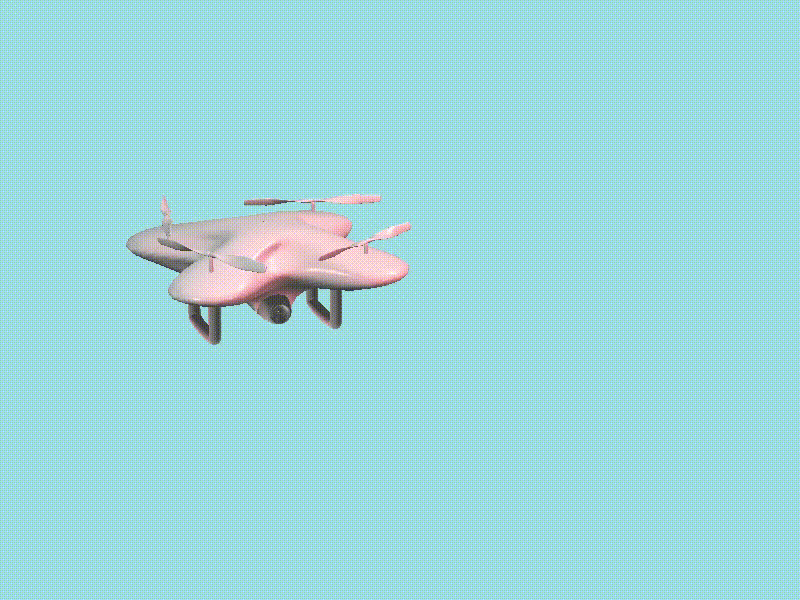
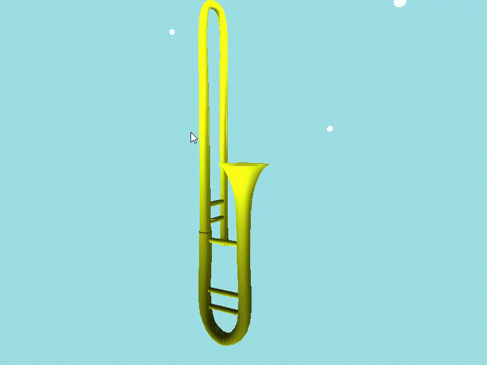
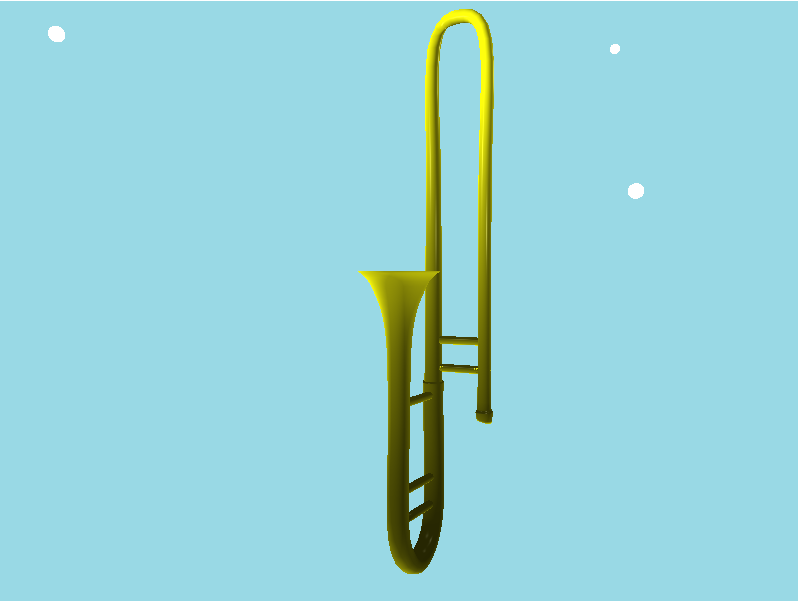
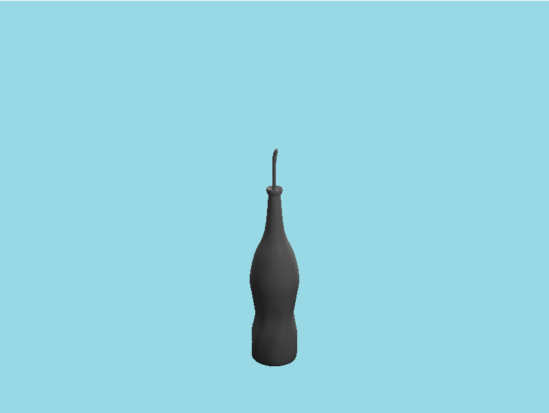
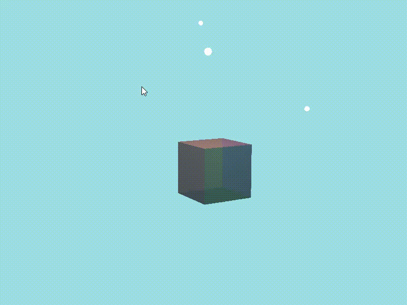

# OpenGL Project

3d graphics를 공부하면서 openGL로 구현했던 것들을 정리했습니다.

사용라이브러리, 헤더파일: glfw3, GLM

## 1. Hierarchical model

glfw라이브러리를 사용했기 때문에 직접 model matrix를 계산하고 곱해가면서 Hierarchical model을 만들었습니다. 제가 만든 object는 drone이고 drone body에 propeller가 돌아가는 object를 만들었습니다. 

 (각 구성요소는 swept surface를 이용하여 생성)

 

## 2. Trackball interface (spline.cpp)

#### view의 rotation은 마우스의 좌 클릭 드래그로 구현하였습니다.

- 첫번째 클릭한 위치의 world space에서의 좌표를 구한다. (up vector와 lookat vector를 외적하여 방향을 구하고 실제화면 에서의 위치로 크기를 구한다.)
- 마우스가 움직이면 움직인 위치의 좌표를 구하고 center of rotation 에서부터의 vector를 구해서 이 두 vector를 외적한 값을 axis로 설정, atan2를 이용하여 두 vector사이의 각도를 구하여 그 값을 rotate angle로 설정한 quaternion을 구한다.
- camera position을 구한 quaternion을 이용하여 center of rotation을 기준으로 회전시킨다.

&nbsp;

#### View의 translation은 마우스의 우클릭 드래그로 구현하였습니다.

- 첫번째 클릭한 위치와 드래그 된 위치의 차이를 위의 방법과 동일하게 구해서 camera position과 center of rotation을 같은 양만큼 더해준다.

&nbsp;

#### Zoom in-out은 마우스 휠로, dolly in-out은 w, d키로 구현하였습니다.

- Zoom in-out: projection matrix를 GLM의 perspective함수로 구현하였는데 여기의 첫번째 변수인 FOV를 휠에 따라 바뀌도록 설정한다.
- Dolly in-out: camera position을 camera position에서 center of rotation을 뺀 vector만큼 w, d키가 눌림에 따라 바뀌도록 설정한다.

 

 track ball interface로 물체를 살펴보는 모습  

&nbsp;

##  3. Swept surface (spline.h)

#### 읽어오는 txt파일의 형식은 단면의 control point들의 정보, scale, rotate angle and axis, translate 이렇게 구성되어 있고 하나의 단면은 b spline, 단면들은 각각의 좌표, factor들을 catmull-rom spline하는 방식으로 구현했습니다.

- txt파일의 정보를 읽은 후 coordinate(vec3), scale(float), rotate quaternion(quat), translate(vec3)의 정보들을 각자의 형식에 맞는 vector에 저장한다

- 각각의 요소들을 catmull-rom spline(end point는 생각하지 않고 시행). Coordinate는 x, y, z 각각 spline, scale은 그 값 자체를 spline, quaternion은 k=3을 가정한 SLERP를 이용한 catmull-rom spline, translate도 x, y, z 각각 spline해준다.

- catmull-rom spline 된 coordinate를 정리하고 하나의 단면을 b-spline으로 spline해주고 catmull-rom spline으로 구했던 scale, rotate, translate을 각 좌표에 적용시켜준다.

 &nbsp;

#### 모든 좌표를 구한 후에 추가로 나중에 lighting할 때 사용할 normal vector를 인접한 4개의 단면의 normal vector를 평균하는 방법으로 각각의 point의 normal vector를 계산하였습니다

- 좌표를 단면의 이동하는 순서로 저장한다.

- 처음 단면과 마지막 단면을 제외한 point은 그 point에 인접한 4개의 면의 normal vector를 외적을 이용하여 구한 후 평균을 구한다.

- 처음과 마지막 단면은 인접한 3개의 면의 normal vector를 외적을 이용하여 구한 후 평균을 구한다.

&nbsp;

#### 마지막으로 EBO(element buffer object)를 이용하여 object를 그릴 예정이기 때문에 삼각형을 그리면서 빈 공간 없이 그려질 수 있도록 하는 좌표들의 순서를 담은 int vector를 만들어 주었습니다. 추가로 사각형 grid를 볼 수 있도록 grid를 그리는 순서를 담은 int vector도 만들어 주었습니다.

&nbsp;

 

## 4. Phong shading (+translucent cube)

#### Phong shading은 GLSL을 이용한 shader의 작성을 통해 구현하였습니다. Point light와 direction light를 GLSL에서 함수를 만들어서 구현하였으며 각각 ambient, diffuse, specular light의 합으로 구현하였습니다. (spline.fs (fragment shader)에 구현)

- Ambient color는 빛의 ambient color, 물질의 ambient color를 입력 받은 후 두 값을 곱하여 구한다.
- Diffuse color는 빛의 diffuse color, 물질의 diffuse color를 입력 받은 후 곱해서 기본 color를 구한 후 물체의 normal vector와 빛의 방향 vector를 내적한 후 0보다 큰 값만 받아서 곱하여 구한다.
- Specular color는 빛의 specular color, 물질의 specular color를 입력 받은 후 곱해서 기본 color를 구한 후 물체의 normal vector를 이용해 빛이 반사되는 방향 vector를 구한 후 반사되는 vector와 물체를 바라보는 vector를 내적한 값을 0보다 큰값만 받고, 물체의 shininess 만큼 power해주어서 구한다.
- Point light의 경우 빛이 거리에 따라 감쇠 되는 정도를 정해진 상수와 거리를 통해 구한 후 마지막에 곱해준다.

&nbsp;

#### Translucent cube는 보는 방향에 따라 각 면을 normal vector를 이용해 depth sorting하여 뒤에 물체부터 그려주는 방식으로 구현하였습니다. (spline.cpp의 make_cube함수)

- 먼저 square를 만든 후 적절히 translate, rotate하여 cube가 되도록 model matrix를 만든다.
- 각각의 model matrix와 그에 해당하는 normal vector와 color의 정보를 담은 vector 생성한다. 
- Normal vector와 view vector를 내적한 값을 기준으로 vector를 sort해준다. (sort함수 이용)
- Sort된 순서대로 model과 color를 적용하여 object를 그린다.

depth sorting을 적용하여 보는 위치에 따라 보이는 그리는 순서를 계속 바꿔주도록 구현한 translucent cube